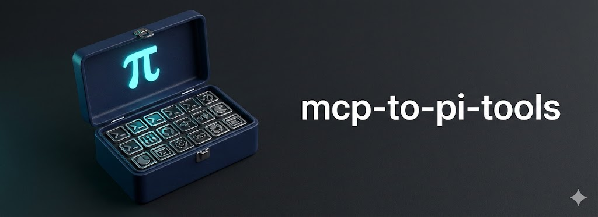

<p>
  
</p>

# mcp-to-pi-tools

**One command turns any MCP server into persistent, agent-ready CLI tools—built for [Pi](https://github.com/badlogic/pi-mono)'s tool conventions.**

[](https://www.npmjs.com/package/mcp-to-pi-tools)
[](LICENSE)
[]()

```bash
npx mcp-to-pi-tools chrome-devtools-mcp
```

## The Problem

[mcporter](https://github.com/steipete/mcporter) converts MCP servers to CLI tools, but using them creates friction for coding agents:

- **Complex syntax** - Agents must construct 100+ character commands correctly
- **Unreliable execution** - Even when documented, agents frequently fumble the CLI syntax, requiring multiple retry loops
- **Poor ergonomics** - Abstract commands feel clunky vs. purpose-built scripts
- **No self-documentation** - Agents can't explore tools via `--help`

**Result:** Agents struggle to use mcporter-converted MCP tools reliably. Even useful MCP tools go underutilized because the CLI interface creates too much friction.

## The Solution

Generate simple, self-documenting CLI tools with short symlinks agents can reliably invoke:

```bash
# Before: 100+ char mcporter commands agents struggle to construct
npx mcporter call --stdio "npx -y chrome-devtools-mcp" chrome-devtools.take_snapshot format:"png"

# After: Short symlinks agents execute reliably
chrome-snapshot --format png
```

| Approach | Command Length | Agent Reliability |
|----------|---------------|-------------------|
| Raw mcporter | 100+ chars | Agents fumble syntax, retry loops |
| Full path | ~55 chars | Reliable but verbose |
| **Symlink** | **~25 chars** | **Minimal, reliable** |

## Why This Works for Pi (and other agents)

**Pi doesn't support MCP directly.** Instead, it relies on simple CLI tools that agents invoke via Bash. The pattern is:

1. Create a CLI tool (any language, any executable)
2. Write a README describing usage
3. Reference it in `AGENTS.md` (global or project-specific)

This tool automates that pattern for MCP servers:

1. **Discovers** MCP tools via mcporter
2. **Generates** each as a standalone executable + README
3. **Registers** them in `AGENTS.md` format

**Result:** MCP tools become first-class Pi-native tools that agents invoke directly.

*For the rationale behind this approach, see [What if you don't need MCP?](https://mariozechner.at/posts/2025-11-02-what-if-you-dont-need-mcp/) by Mario Zechner.*

## Quick Start

```bash
# Generate tools (Node 18+ required)
npx mcp-to-pi-tools chrome-devtools-mcp

# Use immediately via symlink
chrome-snapshot --help

# Or via full path
~/agent-tools/chrome-devtools/chrome-snapshot.js --help
```

> **Note:** Ensure `~/agent-tools/bin` is in your PATH for symlinks to work.

## Usage

> **Note:** If globally installed (`npm install -g mcp-to-pi-tools`), you can omit `npx`.

### Managing Installed Tools

```bash
# List all installed tools
npx mcp-to-pi-tools list

# List and fix missing symlinks/registrations
npx mcp-to-pi-tools list --fix

# Refresh symlinks and registrations for all tools
npx mcp-to-pi-tools refresh

# Refresh a specific tool
npx mcp-to-pi-tools refresh chrome-devtools

# Preview what refresh would do
npx mcp-to-pi-tools refresh --dry-run

# Remove a tool (prompts for confirmation)
npx mcp-to-pi-tools remove chrome-devtools

# Remove without confirmation
npx mcp-to-pi-tools remove chrome-devtools -y

# Preview what would be removed
npx mcp-to-pi-tools remove chrome-devtools --dry-run
```

**Refresh:** Updates existing tools with missing symlinks (for tools installed before symlink support) and updates registrations to use short command names instead of full paths.

### Basic
```bash
# NPM packages (default)
npx mcp-to-pi-tools chrome-devtools-mcp

# Scoped packages
npx mcp-to-pi-tools @org/mcp@1.2.3

# Custom name/location
npx mcp-to-pi-tools chrome-devtools-mcp --name browser-tools --output ./tools
```

### Python Servers
```bash
# Auto-detects uvx (no install needed)
npx mcp-to-pi-tools mcp-server-fetch

# Or be explicit
npx mcp-to-pi-tools mcp-server-fetch --uvx  # via uvx
npx mcp-to-pi-tools mcp-server-fetch --pip  # via pip
```

### Custom Runners
```bash
npx mcp-to-pi-tools --command "docker run -i mcp/fetch" fetch
```

### Options
```
--dry-run          Preview without writing
--force, -f        Update existing tools (preserves user files)
--quiet, -q        Minimal output
--yes, -y          Skip confirmation prompts (for remove)
--no-register      Skip auto-registration
--all-presets      Register to all existing preset files
--no-symlink       Skip symlink creation
--symlink-dir <p>  Custom symlink directory (default: ~/agent-tools/bin)
--force-symlink    Overwrite existing files with symlinks
--agent <name>     Force AI agent (pi, claude, codex). Auto-detects by default.
                   Note: --preset codex implies --agent codex
```

### Updating Tools

Re-run the same command with `--force` to update existing tools:

```bash
npx mcp-to-pi-tools chrome-devtools-mcp --force
```

**Smart updates:**
- Generated files are replaced, user-added files preserved
- Registration entries are updated in-place (no duplicates)
- Symlinks updated if targets changed

### Registration (Auto-config for agents)
```bash
# Default: first existing preset (pi -> claude -> codex -> gemini)
npx mcp-to-pi-tools chrome-devtools-mcp

# Register to ALL existing preset files
npx mcp-to-pi-tools chrome-devtools-mcp --all-presets

# Specific preset(s)
npx mcp-to-pi-tools chrome-devtools-mcp --preset claude --preset gemini

# Custom paths
npx mcp-to-pi-tools chrome-devtools-mcp --register-path ~/.config/AGENTS.md
```

**Presets:** `pi`, `claude`, `gemini`, `codex` (maps to default paths)

## Generated Output

```
~/agent-tools/<name>/
├── README.md           # Human docs
├── <prefix>-tool1.js   # Executable wrapper
└── <prefix>-tool2.js

~/agent-tools/bin/          # Symlinks for PATH access
├── <prefix>-tool1 → ../<name>/<prefix>-tool1.js
└── <prefix>-tool2 → ../<name>/<prefix>-tool2.js
```

Each wrapper:
- Has `#!/usr/bin/env node` shebang
- Supports `--help` with examples
- Outputs errors to stderr
- Uses ES modules
- Symlinked without `.js` extension for cleaner invocation

## Configuration

Create `~/agent-tools/mcp2cli.settings.json` for defaults:

```json
{
  "register": true,
  "registerPaths": ["~/.pi/agent/AGENTS.md", "~/.claude/CLAUDE.md"],
  "symlink": true,
  "symlinkDir": "~/agent-tools/bin"
}
```

## Troubleshooting

| Issue | Fix |
|-------|-----|
| `mcporter not found` | `npm install -g mcporter` |
| Discovery timeout | `MCPORTER_CALL_TIMEOUT=120000 npx mcp-to-pi-tools <pkg>` |
| No AI agent | Works without Pi/Claude (1:1 tool mapping) |

## Contributing

PRs and issues welcome on GitHub.

## License

MIT

## Credits

- **[mcporter](https://github.com/steipete/mcporter)** - Core MCP bridge
- **[Pi](https://github.com/badlogic/pi-mono)** / **Claude Code** - Intelligent grouping via headless mode
- **[MCP](https://modelcontextprotocol.io)** - The protocol
