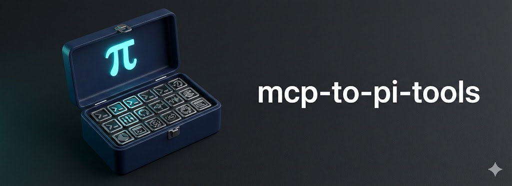

<p>
  
</p>

# mcp-to-pi-tools

**One command turns any MCP server into native pi tools—with automatic grouping, TypeBox schemas, and zero configuration.**

[](https://www.npmjs.com/package/mcp-to-pi-tools)
[](LICENSE)
[]()

```bash
npx mcp-to-pi-tools chrome-devtools-mcp
```

## Quick Start

```bash
# Generate a pi extension from any MCP server
npx mcp-to-pi-tools chrome-devtools-mcp

# Python packages work too
npx mcp-to-pi-tools mcp-server-time --uvx

# List installed extensions
npx mcp-to-pi-tools list
```

Extensions are auto-discovered by pi from `~/.pi/agent/extensions/`—no registration needed.

## What It Does

1. **Discovers** MCP tools via [mcporter](https://github.com/steipete/mcporter)
2. **Groups** related tools using AI (e.g., click + hover + drag → `chrome_interact`)
3. **Generates** a TypeScript pi extension with:
   - `pi.registerTool()` for each grouped tool
   - TypeBox schemas for parameter validation
   - Action discriminators for multi-tool groups
4. **Writes** to `~/.pi/agent/extensions/<name>/`

## Generated Extension Structure

```
~/.pi/agent/extensions/chrome-devtools/
├── index.ts          # Pi extension with registerTool() calls
├── package.json      # Manifest with MCP source info
└── README.md         # Tool documentation
```

### Example Generated Tool

```typescript
// Grouped tool: chrome_interact (wraps: click, hover, drag)
pi.registerTool({
  name: "chrome_interact",
  label: "Chrome Interact",
  description: "Mouse interactions on page elements",
  parameters: Type.Object({
    action: StringEnum(["click", "hover", "drag"] as const),
    uid: Type.String({ description: "Element UID from snapshot" }),
    doubleClick: Type.Optional(Type.Boolean()),
  }),
  async execute(toolCallId, params, onUpdate, ctx, signal) {
    const result = callMcp(params.action, { uid: params.uid, ... });
    return { content: [{ type: "text", text: result }], details: {} };
  },
});
```

## Usage

### Generate Extensions

```bash
# NPM packages
mcp2ext chrome-devtools-mcp
mcp2ext @upstash/context7-mcp

# Python packages
mcp2ext mcp-server-fetch --uvx
mcp2ext mcp-server-time --pip

# Custom command
mcp2ext --command "docker run -i mcp/fetch" --name fetch
```

### Manage Extensions

```bash
# List installed extensions
mcp2ext list

# Remove an extension
mcp2ext remove chrome-devtools

# Regenerate from latest MCP schema (coming soon)
mcp2ext refresh chrome-devtools
```

### Options

```
--name <name>        Extension directory name (default: derived from package)
--output <path>      Output path (default: ~/.pi/agent/extensions/<name>)
--dry-run            Preview generated files without writing
--force, -f          Overwrite existing extension
--quiet, -q          Suppress progress output
--agent <name>       Force AI agent for grouping (pi, claude, codex)
```

### Python/Runner Options

```
--uvx                Use uvx runner (Python packages, no install needed)
--pip                Use pip runner (requires: pip install <package>)
--command <cmd>      Use explicit command (docker, custom paths, etc.)
```

## Migrating from CLI Format

If you have existing tools in `~/agent-tools/`, migrate them to extensions:

```bash
# Scan for migrateable tools
mcp2ext migrate

# Migrate all at once
mcp2ext migrate --all --cleanup

# Migrate one tool
mcp2ext migrate chrome-dev-tools --cleanup
```

See [MIGRATION.md](MIGRATION.md) for the full migration guide.

## Configuration

Create `~/.pi/agent/mcp2ext.settings.json` for defaults:

```json
{
  "agent": "pi"
}
```

## How Tool Grouping Works

AI analyzes MCP tools and groups related operations:

| MCP Tools | Grouped Tool | Action Values |
|-----------|--------------|---------------|
| click, hover, drag | `chrome_interact` | click, hover, drag |
| take_screenshot | `chrome_screenshot` | (single tool, no action) |
| list_console_messages, get_console_message | `chrome_console` | list, get |

For multi-tool groups:
- An `action` parameter is added with enum of tool names
- Parameters from all tools are merged (common ones stay required, tool-specific become optional)
- Execute function dispatches to the appropriate MCP tool

## Troubleshooting

| Issue | Fix |
|-------|-----|
| `mcporter not found` | `npm install -g mcporter` |
| Discovery timeout | `MCPORTER_CALL_TIMEOUT=120000 mcp2ext <pkg>` |
| No AI agent | Works without Pi/Claude (1:1 tool mapping) |
| Extension not loading | Restart pi to pick up new extensions |

---

## Legacy: CLI Wrapper Format

The original `mcp2cli` command generates shell-invokable CLI scripts instead of native extensions.
This format is still supported but deprecated in favor of `mcp2ext`.

### CLI Usage

```bash
# Generate CLI wrappers (legacy)
mcp2cli chrome-devtools-mcp

# Manage CLI tools
mcp2cli list
mcp2cli remove chrome-devtools
mcp2cli refresh
```

### CLI Output

```
~/agent-tools/<name>/
├── README.md
├── chrome-snapshot.js
└── chrome-interact.js

~/agent-tools/bin/
├── chrome-snapshot → ../<name>/chrome-snapshot.js
└── chrome-interact → ../<name>/chrome-interact.js
```

CLI wrappers require:
- `~/agent-tools/bin` in PATH
- Registration in AGENTS.md
- Shell invocation via bash tool

See the [CLI documentation](https://github.com/nicobailon/mcp-to-pi-tools/tree/v1.7.0#readme) for the legacy format.

---

## Contributing

PRs and issues welcome on GitHub.

## License

MIT

## Credits

- **[mcporter](https://github.com/steipete/mcporter)** - Core MCP bridge
- **[Pi](https://github.com/badlogic/pi-mono)** / **Claude Code** - Intelligent grouping via headless mode
- **[MCP](https://modelcontextprotocol.io)** - The protocol
